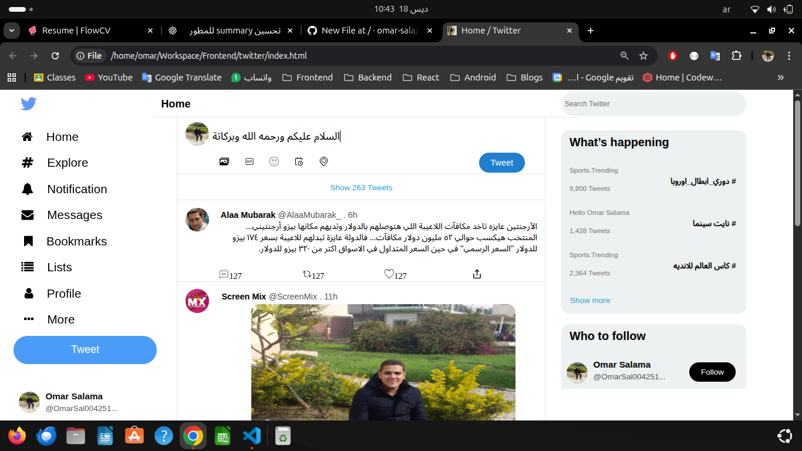
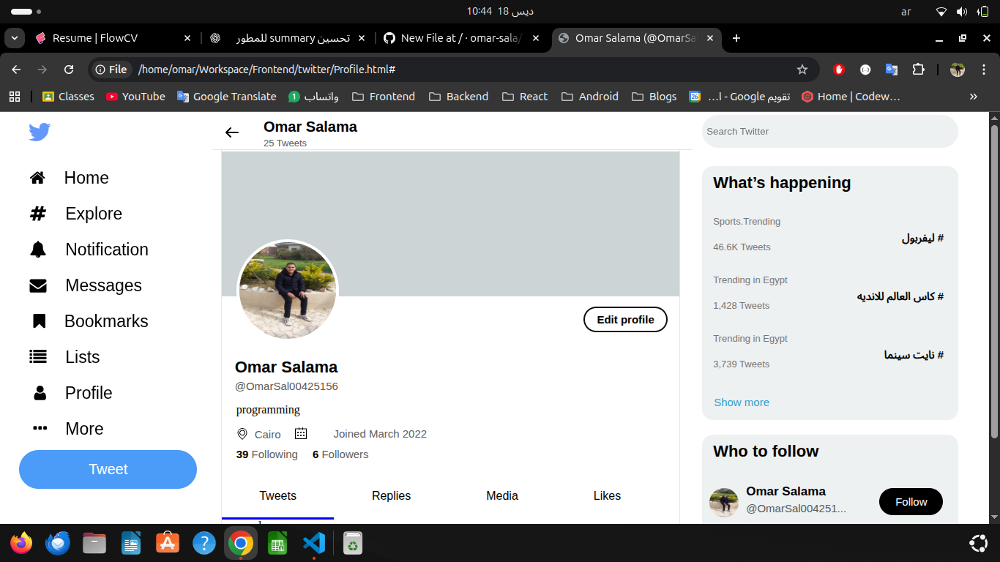

# Twitter Clone (Front-End)

This is a **Front-End clone of Twitter**, built for learning and practice purposes.  
It mimics the UI and basic interactions of Twitter, but **does not include a backend**.

## Screenshot

## Features

- Interactive UI components (buttons, posts, likes, etc.).
- API integration placeholders (ready for future backend).

## Technologies Used

- **HTML** for structuring the web pages.
- **CSS** for styling and layout.
- **JavaScript** for interactivity and dynamic content.
- **Git & GitHub** for version control and project hosting.

## Notes

This project is for learning purposes and practice only.

- Backend functionality like posting tweets or authentication is **not implemented**.
- This was my **first web development project**, helping me learn HTML, CSS, JavaScript, and project structure.
